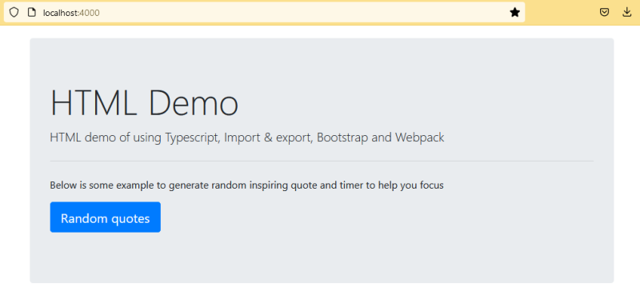

# Js-Webapp-Boilerplate

Boilerplate to generate Javascript file then embed (.js as client-side script) into your web application (HTML/PHP)


# Highlights

1. Using Webpack, Typescript and Bootstraps
2. Code samples showcasing the usage of Webpack, TypeScript, and Bootstrap
3. Demo: A motivational quotes generator

# Screenshot

  

# How to use

Installation

```
npm install
```

---

During development

```
npm run develop
```

Visit http://localhost:4000/ once the page is loaded and ready.
Additionally, any changes made to the .js files will automatically trigger a page refresh.

---

For production

```
npm run build
```

Running this command will generate the `bundle.js` and other necessary files which will be located inside the `/dist` folder

# Download example

You can download the latest release of the app from the following link: https://github.com/hassifmohd/js-webapp-boilerplate/releases/tag/v1

# Explaining what the code does

The main source code for this boilerplate can be found inside the `/src` folder.

In this folder, you will find the following files:

- `index.html`: This file is responsible for the interface of your application.

- `index.ts`: This is the initial JavaScript file, written in TypeScript (.ts extension).

- `app.ts`: The main file where most of the coding is expected to be done. I have added helpful comments to indicate their significance.

# Why I did this?

I created this new GitHub repository with a purpose in mind. Let me share the story behind it. I already had an existing PHP application, and I wanted to enhance its interface using JavaScript.

To achieve this, I needed to utilize certain libraries that were available on npm. However, there was a hurdle to overcome: I had to install Node.js in order to make use of npm. When searching for tutorials online, I noticed that most of them focused on developing JavaScript and deploying it using Node.js. But my intention was different - I wanted to deploy the JavaScript within my existing PHP application. 

After conducting some ~~extensive~~ research, I discovered that using webpack would solve my problem. Additionally, I realized that TypeScript could be a valuable tool to enhance my development experience.

Now that I have reached this stage, I decided to create this boilerplate. It allows me to easily clone this repository whenever I start a new project. Not only does it serve as a platform for my development work, but it also acts as a testing ground for learning more about ES5 and ES6.

With this repository, I hope to simplify and streamline the process of improving interfaces in PHP applications using JavaScript.

# Thanks to

https://blog.logrocket.com/using-webpack-typescript/
