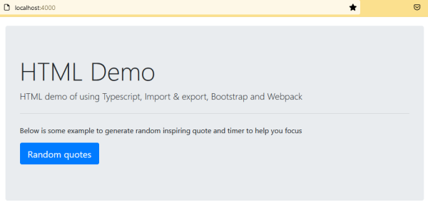

# Js-Webapp-Boilerplate

Boilerplate to generate Javascript file then embed (.js as client-side script) into your web application (HTML/PHP)


# Highlights

1. Using Webpack, Typescript and Bootstraps
2. Code samples showcasing the usage of Webpack, TypeScript, and Bootstrap
3. Demo: A motivational quotes generator

# Screenshot

  

# How to use

Installation

```
npm install
```

---

During development

```
npm run develop
```

Visit http://localhost:4000/ once the page is loaded and ready.
Additionally, any changes made to the .js files will automatically trigger a page refresh.

---

For production

```
npm run build
```

Running this command will generate the `bundle.js` and other necessary files which will be located inside the `/dist` folder

# Thanks to

https://blog.logrocket.com/using-webpack-typescript/
